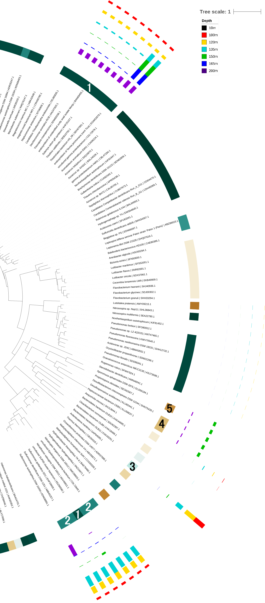

 
<style type="text/css">
/* Makes writing smaller */
body{ /* Normal  */
      font-size: 13px;
}
</style>
 
### Abstract 
 
Analysis of DNA and RNA sequences obtained from Saanich Inlet using high-throughput sequencing has allowed us to examine the nitrogen cycle in this area. This study serves as a great model to examine microbial community responses to changes in the environment such as environmental oxygen levels. Although various genes encode enzymes that are crucial to the nitrogen cycle, our study focuses on the abundance of the *norC* gene, which encodes the nitric oxide reductase subunit C, at various depths. Using the TreeSAPP pipeline it was shown that at all but one depth, *norC* was more abundant at the genome level than at the expression level. Any classified families that contained *norC* in their genome were also found to express it, although the ratios between DNA and RNA abundance differed between the families. Gammaproteobacteria contributed the most to *norC* expression levels at all but one depth, and represented the class with the most *norC* at the genome level as well. A notable exception for expression levels were Epsilonproteobacteria, which were found to express the most *norC* at depth 200m. *NorC* was found to correlate significantly with only one nitrogen species, NH~4~^+^, with which it had a positive correlation. Relations with all the other nitrogen species were negative and insignificant. Although our study focused on one specific gene, the methods could be used to examine the abundance of other genes either involved in the nitrogen cycle or other biogeochemical processes, as well as to gain insight into how microbial communities respond to changes in their surrounding environment. 
 
### Introduction

Saanich Inlet is a seasonally anoxic fjord located between Vancouver Island and the Saanich Peninsula [1]. It is 24 km long and has a basin of up to 234 meters in depth [2]. It has a 75-meter sill which acts to protect the deeper waters [3]. Because of this sill and the constantly high input of organic material from freshwater discharge and primary production in surface waters, its conditions below 110 meters are anoxic [3]. Oxygen replenishment is dependent on the season, occurring mostly in the fall, which modifies the oxygen gradient and thereby the environmental conditions for the microbial community that inhabits the inlet [3]. Dissolved oxygen increases gradually from a minimum concentration at greater depths up to its peak concentration at the surface due to phytoplankton metabolism and atmospheric surface waters gas exchange [3]. Nitrate reduction by denitrifiers happens mostly in the deep water following oxygenation [3]. This results in a steep nitrate gradient when looking at the different depths within the fjord [3]. A study by Zaikova *et al.* found that microbial diversity was highest in the hypoxic transition area and that it decreases within the anoxic basin waters [1]. It is essential to study the roles of various microorganisms within Saanich Inlet in order to understand how they affect environmental conditions like greenhouse gases, methane, and denitrogenation on a larger scale in the world’s oceans [3].

Oxygen minimum zones (OMZ) are areas of the ocean typically occurring between depths of about 200 to 1000 meters where oxygen concentrations are at their lowest [4]. Global OMZs are normally found along the western boundaries of continents where upwelling brings nutrient rich waters from the deep ocean to surface waters. This influx of nutrients increases primary production and therefore the input of organic particle and respiration rates at depth [5]. OMZs are also found in coastal basins where restricted circulation decreases the mixing of deep and surface waters [5]. Saanich Inlet is a glacially carved fjord and is an example of a coastal basin in which the water circulation is decreased by an entrance sill. This in turn restricts oxygen rich water from entering the basin and creates a seasonally anoxic zone at depth [5].
 
A reaction performed by microbes through multispecies microbial interaction is the conversion of the inert elemental nitrogen gas (N~2~) to a usable form that can be used by plants for nucleic acid and protein synthesis [6]. The reductive and irreversible process of converting elemental N~2~ to NH~4~^+^ is catalyzed by nitrogenase - a conserved enzyme complex that is inhibited in the presence of oxygen [6]. NH~4~^+^ can be oxidized to nitrate (NO~3~^−^) in the presence of oxygen through a two-step process. The first step is the oxidation of ammonia (NH~4~^+^) to nitrite (NO~2~^−^) by a particular group of Bacteria or Archaea and the second step involves oxidation of NO~2~^−^ to NO~3~^−^ by a different group of nitrifying microbes [6]. Finally, opportunistic microbes use NO~2~^−^ and NO~3~^−^ as electron acceptors in the absence of oxygen for the oxidation of organic matter. This process ultimately leads to the formation of N~2~ and completion of the nitrogen cycle [6]. The latter process is called denitrification and consist of the dissimilatory reduction of NO~2~^−^ and NO~3~^−^ by denitrifying facultative anaerobes to nitric oxide (NO) and nitrous oxide (N~2~O). These two nitrogen species are classified as ionic nitrogen oxides and act as terminal electron acceptors in anaerobic conditions where they are reduced to dinitrogen (N~2~) [7]. Four functional enzymes are involved in the process of denitrification: nitrate, nitrite, nitric oxide, and nitrous oxide reductases that are encoded by *nar*, *nir*, *nor*, and *nis* gene clusters, respectively [8]. 
 
It is important to note that denitrification increases in oxygen minimum zones (OMZs) in the ocean. The lack of oxygen results in heterotrophic microbes using other oxidants including nitrate and nitrite. This leads to loss of nitrogen from the ocean in the form of N~2~ [9]. Denitrification is an undesirable process for soil fertility and agricultural productivity as it results in loss of fertilizer nitrogen (nitrate) from soil environments [7]. However, it plays a major role in removal of nitrogen from waste, such as animal residues. Denitrification is of major ecological importance since it is responsible for the supply of NO~2~^−^ to the atmosphere and causes stratospheric reactions leading to the depletion of ozone [7]. The absence of this process would result in the accumulation of N~2~ in the atmosphere and NO~3~^−^, a toxin if found at high concentrations, in water and soil environments. In conclusion, the absence of denitrification would result in disruption of the nitrogen cycle [7]. 
 
The microbial species involved in denitrification are able to use nitrogen oxides as electron acceptors in place of oxygen under anaerobic conditions. One group of denitrifying bacteria is photosynthetic; however, most are heterotrophs and some are autotrophs that utilize reduced sulphur compounds or H~2~ and CO~2~ [7].  Important denitrifiers isolated from soil and aquatic environments include members of the **Achromobacter**, **Alcaligenes**, **Bacillus**, **Chromobacterium**, **Chromobacterium**, **Halobacterium**, **Hyphomicribium**, **Moraxella**, **Paracoccus**, and **Pseudomonas** genera [7]. Altogether, the nitrogen cycle could be more accurately represented as a complex metabolic network [10], and the Saanich Inlet is a model ecosystem for studying how the components of that network are distributed across both taxa and depth [3]. We focused our investigations on *norC*, which is the component of the denitrification pathway responsible for the reduction of NO to N~2~O. 
 
 
### Methods 
 
#### Sample collection and processing
 
Water samples were collected from 16 depths (10-200m) at station S3 in Saanich Inlet (48°35.500 N, 123°30.300 W) onboard MSV John Strickland during cruise 72 (August 1, 2012). Water samples (2L) were filtered through a 0.22 µm Sterivex filter to collect biomass, which was stored at -80˚C for further multi-omic analyses. Geochemical data was measured *in situ* using a Sea-Bird SBE 43 and in the laboratory on water samples collected using various assays [3, 11].  
 
Total genomic DNA and RNA was extracted from Sterivex filters for 7 depths (10, 100, 120, 135, 150, 165, 200m). Illumina metagenomic shotgun libraries were constructed from reversed transcribed genomic RNA (cDNA) and genomic DNA, and were paired end sequenced (2x150bp technology) on the Illumina HiSeq platform at the US Department of Energy Joint Genome Institute (DOE JGI). Processing and quality control of the output reads were also done at JGI using the IMG/M pipeline, and the assembly and processing of the metagenomes were done at the University of British Columbia using MetaPathways 2.5 [11]. 
 
In-depth sampling and sequencing methods can be found here: [Hawley AK *et al* 2017](https://www.ncbi.nlm.nih.gov/pmc/articles/PMC5663217/#b20), “A compendium of multi-omic sequence information from the Saanich Inlet water column” Sci Data 4: 170160. 
 
#### Data analysis
 
##### TreeSAPP
 
Tree-based Sensitive and Accurate Protein Profiler (TreeSAPP) was used through Google Cloud services to reconstruct the nitrogen cycle in Saanich Inlet along defined redox gradients. Computational servers were linked to Google Cloud storage using the `gcsfuse` command. To allow for continuous processing of the data while offline the ‘nohup’ command was used. DNA and RNA assemblies were processed for *norC* (D0502) through the TreeSAPP pipeline and SAM files were immediately removed using the following code:
 
```{}
# Code for NorC processing of the RNA and DNA samples
rm -rf treesapp_out
 
for 10m, 100m, 120m, 135m, 150m, 165m and 200m depths:
 
        time treesapp.py -T 8 --verbose --delete -t D0502 --rpkm \
        -i bucket/MetaG_assemblies/SI072_LV_"$depth"_DNA.scaffolds.fasta \
        -r bucket/MetaG_reads/SI072_LV_"$depth".anqdp.fastq.gz \
        -o treesapp_out/dna/"$depth"
 
        rm  treesapp_out/dna/"$depth"/RPKM_outputs/*.sam
 
 
        time treesapp.py -T 8 --verbose --delete -t D0502 --rpkm \
        -i bucket/MetaG_assemblies/SI072_LV_"$depth"_DNA.scaffolds.fasta \
        -r bucket/MetaT_reads/SI072_LV_"$depth".qtrim.3ptrim.artifact.rRNA.clean.fastq.gz \
        -o treesapp_out/rna/"$depth"
 
        rm  treesapp_out/rna/"$depth"/RPKM_outputs/*.sam
```
 
##### iTOL
 
TreeSAPP output data found under `treesapp_out/iTOL_output/` were visualized in a phylogenetic tree using [Interactive Tree of Life (iTOL)](http://itol.embl.de/) software 4.2 v1.0 [12].
 
##### R setup
 
Analysis was completed in R v3.4.3 [13] using the following packages.
```{r eval=TRUE, message=FALSE, warning=FALSE}
library(tidyverse)
library(cowplot)
library(phyloseq)
library(grid)
library(knitr)
```
 
Taxonomy, abundance, and query data were loaded from "marker_contig_map.tsv" files obtained from TreeSAPP.
```{r message=FALSE}
treesapp.out.dir = "./treesapp_out_gene_tax_abd/"
# Example data loading
norC.DNA.10m = read_tsv(paste(treesapp.out.dir, "dna/10m/final_outputs/marker_contig_map.tsv", sep="")) %>% 
  select(Tax.DNA.10 = Confident_Taxonomy, Abund.DNA.10 = Abundance, Query)
```
 
```{r message=FALSE, echo=FALSE}
# Rest of data loading
norC.DNA.100m = read_tsv(paste(treesapp.out.dir, "dna/100m/final_outputs/marker_contig_map.tsv", sep="")) %>% 
  select(Tax.DNA.100 = Confident_Taxonomy, Abund.DNA.100 = Abundance, Query)
norC.DNA.120m = read_tsv(paste(treesapp.out.dir, "dna/120m/final_outputs/marker_contig_map.tsv", sep="")) %>% 
  select(Tax.DNA.120 = Confident_Taxonomy, Abund.DNA.120 = Abundance, Query)
norC.DNA.135m = read_tsv(paste(treesapp.out.dir, "dna/135m/final_outputs/marker_contig_map.tsv", sep="")) %>% 
  select(Tax.DNA.135 = Confident_Taxonomy, Abund.DNA.135 = Abundance, Query)
norC.DNA.150m = read_tsv(paste(treesapp.out.dir, "dna/150m/final_outputs/marker_contig_map.tsv", sep="")) %>% 
  select(Tax.DNA.150 = Confident_Taxonomy, Abund.DNA.150 = Abundance, Query)
norC.DNA.165m = read_tsv(paste(treesapp.out.dir, "dna/165m/final_outputs/marker_contig_map.tsv", sep="")) %>% 
  select(Tax.DNA.165 = Confident_Taxonomy, Abund.DNA.165 = Abundance, Query)
norC.DNA.200m = read_tsv(paste(treesapp.out.dir, "dna/200m/final_outputs/marker_contig_map.tsv", sep="")) %>% 
  select(Tax.DNA.200 = Confident_Taxonomy, Abund.DNA.200 = Abundance, Query)
 
norC.RNA.10m = read_tsv(paste(treesapp.out.dir, "RNA/10m/final_outputs/marker_contig_map.tsv", sep="")) %>% 
  select(Tax.RNA.10 = Confident_Taxonomy, Abund.RNA.10 = Abundance, Query)
norC.RNA.100m = read_tsv(paste(treesapp.out.dir, "RNA/100m/final_outputs/marker_contig_map.tsv", sep="")) %>% 
  select(Tax.RNA.100 = Confident_Taxonomy, Abund.RNA.100 = Abundance, Query)
norC.RNA.120m = read_tsv(paste(treesapp.out.dir, "RNA/120m/final_outputs/marker_contig_map.tsv", sep="")) %>% 
  select(Tax.RNA.120 = Confident_Taxonomy, Abund.RNA.120 = Abundance, Query)
norC.RNA.135m = read_tsv(paste(treesapp.out.dir, "RNA/135m/final_outputs/marker_contig_map.tsv", sep="")) %>% 
  select(Tax.RNA.135 = Confident_Taxonomy, Abund.RNA.135 = Abundance, Query)
norC.RNA.150m = read_tsv(paste(treesapp.out.dir, "RNA/150m/final_outputs/marker_contig_map.tsv", sep="")) %>% 
  select(Tax.RNA.150 = Confident_Taxonomy, Abund.RNA.150 = Abundance, Query)
norC.RNA.165m = read_tsv(paste(treesapp.out.dir, "RNA/165m/final_outputs/marker_contig_map.tsv", sep="")) %>% 
  select(Tax.RNA.165 = Confident_Taxonomy, Abund.RNA.165 = Abundance, Query)
norC.RNA.200m = read_tsv(paste(treesapp.out.dir, "RNA/200m/final_outputs/marker_contig_map.tsv", sep="")) %>% 
  select(Tax.RNA.200 = Confident_Taxonomy, Abund.RNA.200 = Abundance, Query)
```
 
The data were then combined into a single data frame.
```{r, warning=FALSE}
# Combine the data frames
norC.all = norC.DNA.10m %>% 
  full_join(norC.DNA.100m, by = "Query") %>% 
  full_join(norC.DNA.120m, by = "Query") %>% 
  full_join(norC.DNA.135m, by = "Query") %>% 
  full_join(norC.DNA.150m, by = "Query") %>% 
  full_join(norC.DNA.165m, by = "Query") %>% 
  full_join(norC.DNA.200m, by = "Query") %>% 
  full_join(norC.RNA.10m,  by = "Query") %>% 
  full_join(norC.RNA.100m, by = "Query") %>% 
  full_join(norC.RNA.120m, by = "Query") %>% 
  full_join(norC.RNA.135m, by = "Query") %>% 
  full_join(norC.RNA.150m, by = "Query") %>% 
  full_join(norC.RNA.165m, by = "Query") %>% 
  full_join(norC.RNA.200m, by = "Query") %>% 
# Create a taxonomy variable aggregating all taxonomy columns to fill in any NAs
  mutate(Taxonomy = ifelse(!is.na(Tax.DNA.10), Tax.DNA.10,
                    ifelse(!is.na(Tax.DNA.100), Tax.DNA.100,
                    ifelse(!is.na(Tax.DNA.120), Tax.DNA.120,
                    ifelse(!is.na(Tax.DNA.135), Tax.DNA.135,
                    ifelse(!is.na(Tax.DNA.150), Tax.DNA.150,
                    ifelse(!is.na(Tax.DNA.165), Tax.DNA.165,
                    ifelse(!is.na(Tax.DNA.200), Tax.DNA.200,
                    ifelse(!is.na(Tax.RNA.10), Tax.RNA.10,
                    ifelse(!is.na(Tax.RNA.100), Tax.RNA.100,
                    ifelse(!is.na(Tax.RNA.120), Tax.RNA.120,
                    ifelse(!is.na(Tax.RNA.135), Tax.RNA.135,
                    ifelse(!is.na(Tax.RNA.150), Tax.RNA.150,
                    ifelse(!is.na(Tax.RNA.165), Tax.RNA.165,
                    ifelse(!is.na(Tax.RNA.200), Tax.RNA.200,
                           "unclassified"))))))))))))))) %>% 
# Remove old Tax variables
  select(-starts_with("Tax.")) %>% 
# Gather all the abundance data into 1 column 
  gather("Key", "Abundance", starts_with("Abund")) %>% 
# Turn the Key into Depth and RNA/DNA variables
  separate(Key, c("Key","Type","Depth_m"), by = ".") %>% 
# Remove Key variable and reorder the columns with Query at the end
  select(Depth_m, Type, Abundance, Taxonomy, Query) %>% 
# Make depth numerical
  mutate(Depth_m = as.numeric(Depth_m)) %>% 
# Separate Taxonomy into columns
  separate(Taxonomy, into = c("Domain", "Phylum", "Class", "Order", "Family", "Genus", "Species"), sep="; ")
```
 
Note that not all queries could be classified at the species level, so those cells were filled in with NA.
 
Geochemical data from cruise 72 (Aug 1, 2012) were loaded in order to draw correlations with *norC* abundance.
 
```{r}
load("mothur_phyloseq.RData")
metadata = data.frame(mothur@sam_data)
```
 
#### Analysis steps
 
The variation in the abundance of *norC* DNA and RNA with depth was examined by plotting the abundances at the different depths. Both abundances were then stratified at the family and class level as well. The presence of *norC* RNA was then examined in relation to N~2~O, NH~4~^+^, NO~2~^-^, NO~3~^-^, and O~2~ at the different depths. The abundances were also correlated with nitrogen species N~2~O, NH~4~^+^, NO~2~^-^, NO~3~^-^ and O~2~ using a linear model using the `lm()` function in the stats R packages as per code found in the results section [14].
 
 
### Results
 
#### *NorC* DNA and RNA Abundance with Depth
 
```{r fig.width=5, fig.height=4}
# Save gene abundance data
gene_abd_depth = norC.all %>% 
  # Group data by depth and type (RNA/DNA)
  group_by(Depth_m, Type) %>% 
  # Filter out NAs
  filter(!is.na(Abundance)) %>%
  # Sum up the abundance data for each depth for RNA and DNA
  summarize(Abundance = sum(Abundance)) %>% 
  # Round the sums
  mutate(Abundance = round(Abundance, digits = 2)) 
 
# Plot the abundance data
ggplot(gene_abd_depth, aes(x = Type, y = Depth_m)) +
  geom_point(aes(size = Abundance)) +
  geom_text(aes(label = Abundance, hjust = -0.5)) +
  scale_y_reverse(lim=c(200,10)) +
  labs(x = NULL) + 
  theme(legend.position="none")
 
```
 
**Figure 1** RPKM abundance (value labels) of *norC* at the genome and expression level across different depths for samples obtained at Saanich Inlet.
<br><br>
 
The abundance of *norC* differs with depth (Figure 1). No *norC* was found at either the genome or expression level at 10m. For DNA the abundance is increasing with depth until 150m, where it is maximal. Then the abundance abruptly drops at 165m, and then is relatively high again at 200m. For RNA, *norC* abundance is relatively low up to depth 135m, only slowly increasing. Then the abundance is notably greater at 150m, and maximum RNA abundance is reached at 165m. Then RNA abundance decreases again at 200m.
 
The graph shows that the abundance of DNA differs from the abundance of RNA. DNA abundance is notably higher at depths up to depth 150m. DNA abundance is maximal at 150m, where RNA abundance is lower, and RNA abundance is maximal at 165m, where DNA abundance is quite low. We see about the same amount of *norC* RNA and DNA at 200m.
 
#### Taxa Responsible for *norC* Abundance
 
```{r warning=FALSE, fig.width=7, fig.height=5}
norC.all %>% 
  # Change NAs to "unclassified"
  mutate(Family = ifelse(is.na(Family), "unclassified", Family)) %>% 
  # Remove 0 abundance
  mutate(Abundance = ifelse(Abundance == 0, NA, Abundance)) %>%
 
# Plot the data
ggplot(aes(x = Family, y = Depth_m)) +
  # Keep points from overlapping
  geom_point(aes(size = Abundance, color = Type), position = position_dodge(0.6)) +
  scale_y_reverse(lim=c(200,10)) +
  labs(x = "Family") + 
  theme(axis.text.x = element_text(angle = 20, hjust = 1), plot.margin= margin(0,0,0,20))
```
 
**Figure 2** RPKM abundance of *norC* stratified at the family level. Abundance is shown at both the genome and expression level across different depths. The size of each circle is proportional to abundance.
<br><br>
 
In total seven fully classified families were found to contribute to the *norC* DNA and RNA levels, along with some unclassified Thiotrichales and fully unclassified organisms (Figure 2). All classified families that contribute some amount to the DNA levels, were found to also contribute a nonzero amount to the RNA levels.  
 
A different number of classified families was found to contribute to the DNA and RNA levels at different depths. The smallest number of classified families, only three, contribute at depths of 100m, 120m, and 165m, while the biggest number of classified families, six, contribute at a depth of 150m. Some families were found to contribute to *norC* levels only at one depth, while others contribute at more depths.  
 
At every depth, the family Candidatus Thioglobus was found to contribute the most to *norC* DNA abundance, while the second biggest contributors were unclassified organisms. The biggest contributors to RNA abundance at the majority of depths were found to be unclassified organisms. This is while at depth 200m Helicobacteraceae contribute the most to RNA abundance.  
 
```{r warning=FALSE, fig.width=7, fig.height=5}
norC.all %>% 
  # Change NAs to "unclassified"
  mutate(Class = ifelse(is.na(Class), "unclassified", Class)) %>% 
  # Remove 0 abundance
  mutate(Abundance = ifelse(Abundance == 0, NA, Abundance)) %>%
 
ggplot(aes(x = Class, y = Depth_m)) +
  # Keep points from overlapping
  geom_point(aes(size = Abundance, color = Type), position = position_dodge(0.6)) +
  scale_y_reverse(lim=c(200,10)) +
  labs(x = "Class") + 
  theme(axis.text.x = element_text(angle = 20, hjust = 1))
```
 
**Figure 3** RPKM abundance of *norC* stratified at the class level. Abundance is shown at both the genome and expression level across different depths. The size of each circle is proportional to abundance.
<br><br>
 
Viewed at the class level, it can be seen that the unclassified organisms responsible for most of the RNA are of the class Gammaproteobacteria (Figure 3).
 
These patterns can also be seen by visualizing the data on iTOL (sample in Appendix Figure A1). The expression of *norC* is observed to be localized to a few classes. Classes with the highest levels of *norC* expression are variable with respect to depth. Epsilonproteobacteria and Ardenticatenia were observed to have greater expression at 135m or shallower, while Gammaproteobacteria expression is more biased towards greater depths.
 
#### *NorC* Abundance and Nitrogen Species
 
```{r}
# Save plot of abundance data
plot_abd_depth = ggplot(gene_abd_depth, aes(x = Type, y = Depth_m)) +
  geom_point(aes(size = Abundance)) +
  scale_y_reverse(lim=c(200,10)) +
  labs(x = "", y = NULL) + 
  theme(plot.margin = unit(c(0,0,0.55,0), "cm"))
```
 
 
```{r}
# Order the data by depth
metadata_depth = metadata %>% arrange(Depth_m)
 
# Example plot code
# Save plot for NO3 metadata as it changes with depth
plot_NO3 = metadata_depth %>% 
ggplot(aes(x = NO3_uM, y = Depth_m)) +
  geom_point() +
  geom_path(aes(group = 1)) +
  scale_y_reverse(lim=c(200,10)) +
  labs(y = "Depth (m)", x = "NO3 (uM)") +
  theme(axis.text.x = element_text(angle = 90, hjust = 1),
        plot.margin = unit(c(0,0.1,0.3,0), "cm"))
```
 
 
```{r, echo=FALSE}
# Save plot for NO2 metadata as it changes with depth
plot_NO2 = metadata_depth %>% 
ggplot(aes(x = NO2_uM, y = Depth_m)) +
  geom_point() +
  geom_path(aes(group = 1)) +
  scale_y_reverse(lim=c(200,10)) +
  labs(y = NULL, x = "NO2 (uM)") +
  theme(axis.text.x = element_text(angle = 90, hjust = 1),
        plot.margin = unit(c(0,0.1,0,0), "cm"))
 
# Save plot for NH4 metadata as it changes with depth
plot_NH4 = metadata_depth %>% 
ggplot(aes(x = NH4_uM, y = Depth_m)) +
  geom_point() +
  geom_path(aes(group = 1)) +
  scale_y_reverse(lim=c(200,10)) +
  labs(y = NULL, x = "NH4 (uM)") +
  theme(axis.text.x = element_text(angle = 90, hjust = 1),
        plot.margin = unit(c(0,0.1,0.5,0), "cm"))
 
# Save plot for N2O metadata as it changes with depth
plot_N2O = metadata_depth %>% 
ggplot(aes(x = N2O_nM, y = Depth_m)) +
  geom_point() +
  geom_path(aes(group = 1)) +
  scale_y_reverse(lim=c(200,10)) +
  labs(y = NULL, x = "N2O (nM)") +
  theme(axis.text.x = element_text(angle = 90, hjust = 1),
        plot.margin = unit(c(0,0.1,0.3,0), "cm"))
 
# Save plot for O2 metadata as it changes with depth
plot_O2 = metadata_depth %>% 
ggplot(aes(x = O2_uM, y = Depth_m)) +
  geom_point() +
  geom_path(aes(group = 1)) +
  scale_y_reverse(lim=c(200,10)) +
  labs(y = NULL, x = "O2 (uM)") +
  theme(axis.text.x = element_text(angle = 90, hjust = 1),
        plot.margin = unit(c(0,0.1,0.3,0), "cm"))
```
 
```{r fig.width=8, fig.height=4}
# Create composite figure
plot_grid(plot_N2O, plot_NH4, plot_NO2, plot_NO3, plot_O2, plot_abd_depth, 
          labels=c("A", "B", "C", "D", "E", "F"), 
          nrow = 1, 
          rel_widths=c(1.2,1,1,1,1,2.4))
```
 
**Figure 4** Nitrogen species and oxygen concentrations across depth (A-E) compared to *norC* abundance at both the genome and expression level (F; reproduced from Figure 1)
<br><br>
 
The relation between *norC* abundance and nitrogen species and oxygen was examined (Figure 4). NO~3~^-^ and N~2~O concentrations are seen to peak at 100m, where some *norC* DNA is observed, but not much *norC* RNA. NO~3~^-^ and N~2~O then decrease with greater depth, as DNA and RNA levels increase. NO~2~^-^ is relatively constant, between about 0.05uM to 0.10uM, at depths 100m to 165m, where *norC* DNA and RNA levels increase. This is while NH~4~^+^ increases in concentration with depth, starting at a depth of 150m, seemingly increasing with RNA levels. There was lower oxygen concentration where there was a higher RNA abundance. These possible relationships were further examined with linear models.
 
```{r fig.width=12, fig.height=7}
# Combine gene abundance data with metadata
gene_abd_depth_meta = metadata %>% 
  # Change N2O to also be in uM like the others
  mutate(N2O_uM = N2O_nM / 1000) %>% 
  # Select columns of interest
  select(Depth_m, NH4_uM, N2O_uM, NO2_uM, NO3_uM, O2_uM) %>% 
  # Rename the columns
  rename("NH4 (uM)" = NH4_uM) %>% 
  rename("N2O (uM)" = N2O_uM) %>% 
  rename("NO2 (uM)" = NO2_uM) %>% 
  rename("NO3 (uM)" = NO3_uM) %>% 
  rename("O2 (uM)" = O2_uM) %>% 
  # Join the abundance data and metadata
  gather(Nutrient,uM,-Depth_m) %>% 
  full_join(gene_abd_depth, by = "Depth_m") %>% 
  unite(Type_Nutrient, Type, Nutrient, sep = " - ") %>% 
  arrange(desc(Type_Nutrient))
 
# Plot the data
ggplot(gene_abd_depth_meta, aes(x = uM, y=Abundance)) +
  geom_point() +
  facet_wrap(~Type_Nutrient, scales="free", ncol = 5) +
  geom_smooth(method='lm') +
  labs(y = "Abundance", x = "Concentration (uM)") +
  theme(text = element_text(size=18))
```
 
**Figure 5** RPKM abundance of *norC* at different nitrogen species concentrations. Abundance is shown at both the genome and expression level.
<br><br>
 
The presence and expression of the *norC* gene was only positively associated with NH~4~^+^ levels, while all other correlations revealed negative trends.
 
```{r}
# Initialize a data frame
RNA_abundance = data.frame(matrix(ncol = 5, nrow= 0))
 
for (type_nutrient in unique(gene_abd_depth_meta$Type_Nutrient)) {
  # Get the summary of lm()
  summ = gene_abd_depth_meta %>%
    filter(Type_Nutrient == type_nutrient) %>% 
    lm(Abundance ~ uM, .) %>%
    summary()
  # Pull out the statistics values
  coef = summ$coefficients["uM",]
  # Convert into a data frame
  coef_data_frame = data.frame(coef=matrix(coef),row.names=names(coef))
  # Add to data frame for table
  RNA_abundance[nrow(RNA_abundance) + 1,] <-c(type_nutrient, round(coef_data_frame[,1], 3))
}
# Reverse order to agree with graphs
RNA_abundance = RNA_abundance[nrow(RNA_abundance):1,]
# Name the columns
colnames(RNA_abundance) <- (c("Correlation", "Estimate", "Std. Error","t value","Pr(>|t|) (p-value)"))
# Make a table for the data
kable(RNA_abundance,row.names=FALSE,caption="Table 1 Correlation of *norC* Abundance across Nitrogen Species and Oxygen Concentrations.")
 
```
 
*NorC* expression was found to significantly positively correlate with NH~4~^+^ levels (p = 0.005). No other significant correlations were observed at either the genome or the expression level.  
 
Expression level significances (ranging p = 0.005-0.273) were generally higher than those of the genome level (ranging p = 0.202-0.951). 
 
 
### Discussion
 
While we only investigated a single component of the denitrification pathway, *norC*’s results can be related to the complex nitrogen metabolic network. At the shallow depth of 10m, *norC* gene copies and transcripts are not found at detectable levels (Figure 1), which suggests that the complete denitrification pathway is not active. There could be multiple reasons why the denitrification pathway is not active in surface waters. For one, there is ample oxygen and sunlight present for phototrophs to produce energy without requiring the less-efficient denitrification pathway [15, 16]. Second, nitrate is depleted at this depth (Figure 4) and any free nitrogen is likely required for primary production and assimilatory mechanisms to support amino acid and nucleotide synthesis [17].

Aerobic denitrification has been found in harsh environments where the oxygen concentration fluctuates. It is the main source of atmospheric N~2~O which has been rising due to the uncontrolled use of fertilizer in agriculture and the intensification of OMZs globally [18]. The trends in NO~3~^−^, NO~2~^-^ and NH~4~^+^ levels across depths in Saanich Inlet (Figure 4) are consistent with literature in which heterotrophic microbes were found to utilize other oxidants, such as NO~3~^-^ and NO~2~^-^, in anoxic environments [19]. This shift in metabolic activity from oxic to anoxic waters results in NO~3~^-^ and NO~2~^-^ being consumed and depleted in anoxic environments as well as  NH~4~^+^ being produced. While denitrifying microbes produce NO and N~2~O, other heterotrophic microbes in anoxic environments reduce NO~3~^-^ and NO~2~^-^ to NH~4~^+^ , consistent with the observation of high NH~4~^+^ concentrations in the anoxic layer (Figure 4) [20]. The relationship between NH~4~^+^ levels and *norC* expression is shown to be positive and significant (Table 1).

Interestingly, the concentration of N~2~O peaks at 100m and gradually decreases, reaching a minimum at 200m (Figure 4). This could be seen as paradoxical since the abundance of *norC* gene copies and transcripts is increasing with depth and they are responsible for the production of N~2~O [20], so the concentration of N~2~O would be expected to increase with depth. However, N~2~O production is dependent on the presence of other genes involved in the denitrification pathway such as *nar*, *nir*, *nor*, and *nis* gene clusters [10]. Additionally, N~2~O production is also dependent on NO~3~^-^ levels which follow a trend similar to N~2~O concentrations (Figure 4). Thus, it is tempting to argue that the highest N~2~O concentrations are found at ~100m because of the dependency of the denitrification pathway on NO~3~^-^ as a substrate. However, NO~3~^-^ should not be present where higher rates of denitrification are present since it is consumed by this process and denitrification rates have been shown to be greater at depths where oxygen is depleted [21]. Studies have also shown that N~2~O is consumed by microbes during the last step in canonical denitrification, which occurs in strictly anoxic environment [22]. This suggests that the the low N~2~O levels within the anoxic layer do not represent a low rate of N~2~O production, but instead the production of N~2~O and its subsequent consumption by the microbial community. This last step of the canonical denitrification pathway in which N~2~O is being consumed is done through the nitrous oxide reductase gene (*nosZ*) and therefore it would be interesting to investigate how active this gene is at depth in the inlet.

Many of the *norC*-containing species we identified are known to be important in the nitrogen cycle. Among the identified classes, Gammaproteobacteria contributed the most to *norC* DNA and RNA abundance across the majority of depths (Figure 3). This comes as no surprise because Gammaproteobacteria are known to be common marine denitrifiers [23, 24]. Now focusing our analysis at the family taxonomic level, we found that Candidatus Thioglobus contributed the most to *norC* DNA abundance (Figure 2), which is consistent with literature as the members of that family have been found to produce nitrate, while they are also abundant in OMZs [25]. Interestingly, the family Helicobacteraceae has been found to co-occur with denitrification on elemental sulfur particles [26], which our results support because we only observed high *norC* expression in Helicobacteraceae at a depth of 200m where sulphur is expected to be highest (Figure 2) [3]. Elucidating which clades contribute to the denitrification pathway by expressing *norC* is important because it completes one piece of the puzzle that is the nitrogen distributed metabolic network.

Distributed metabolism as demonstrated by the nitrogen cycle is beneficial for the overall survival of the pathway. For example, nitrogenase genes are spread out among different microbes in aerobic and anaerobic environments [27]. This broad distribution of nitrogen-fixing genes reflects the different environments these microbes inhabit [27]. Since the nitrogen cycle is vital for the survival of many plants and animals, a greater distribution of important genes and components for the cycle increases the likelihood of gene persistence through environmental adaptation. Without *norC*, the denitrification pathway would be incomplete, impacting the entire nitrogen cycle. Denitrification is important for converting nitrate to nitrogen gas by removing bioavailable nitrogen and returning it to the atmosphere [27]. Without this step, nitrogen would remain fixed as the nitrate state in the ecosystem [27]. In terrestrial ecosystems, adding nitrogen can cause nutrient imbalance in trees and change the forest health, eventually leading to a decline in biodiversity [27]. With recent developments in agriculture, much of the nitrogen used in urban and agricultural activities eventually leaches out of the soil and into bodies of water like rivers and streams [27]. In nearshore marine systems, excess nitrogen can lead to eutrophication [27]. To avoid such catastrophic changes to the environment, having vital nitrogen genes distributed among different microbial species prevents accumulation of nitrogen in the anoxic zones of lakes and oceans. Species that cannot adapt to extreme environmental pressures, whether occurring naturally or through human industrial alterations, will not cause the breakdown of the nitrogen cycle. Other microbes that have the capacity to survive harsh environments and have the corresponding genes, will take their place within the denitrification step, ensuring a seamless continuation of the major transformations within the cycle. 

When we consider the evolutionary benefits for having a distributed metabolism among different microbes, one potential benefit may be that by doing so, microbes can make their genomes smaller. Having a smaller genome can provide a selective advantage. Giovannoni studied how B vitamins are distributed in complex patterns [28]. An important point that he brings up is that survival of the different plankton species all depends on vitamins that are made within the community - “a cell that needs a vitamin can only thrive in a community that provides it” [28]. Also, connectedness has become an important concept because it can help explain the response of biological communities to stresses [28]. Giovannoni observes that in fluctuating ocean conditions, the fluxes of reduced sulfur and glycine are sufficient to meet a certain species’ requirement most of the time [28]. By relying on the natural sulfur and glycine, the microbes no longer need the genes to reduce the sulfur or glycine themselves, thereby reducing the energy expended by the microbes. This suggests that the fitness advantages of smaller genomes and lower cellular costs offset the potential gain in fitness that would come from producing the required compounds when they are in short supply in the environment [28]. This is not a direct correlation of  the nitrogen cycle, but a concept can be extracted from this example. By distributing genes for the nitrogen cycle, with smaller genomes microbes have a selective advantage for survival. 

Future studies should examine the potential presence of metabolic interactions between genera expressing *norC* gene. These possible interactions may impact and alter the abundance and the role of these genera within the community at a specific depth. Although our study focused on one specific gene, the methods could be used to examine the abundance of other genes to further gain insight regarding other biogeochemical processes through microbial metabolism. So one could further examine the genomes of the organisms present in the sample to determine whether there are any other distributed metabolisms among the species. Perhaps other pathways would be discovered, where the bacteria are interdependent on one another, each providing substrates for the other.  
 
 
### References
 
[1] Zaikova E., Walsh DA, Stilwell CP, Mohn WW, Tortell PD, Hallam SJ. 2010. Microbial community dynamics in a seasonally anoxic fjord: Saanich Inlet, British Columbia. Environmental Microbiology 12:172-191. 

[2] Herlinveaux RH. 2011. Journal of the Fisheries Research Board of Canada 19: 1-37.

[3] Torres-Beltrán M, Hawley AK, Capelle D, Zaikova E, Walsh DA, Mueller A, Scofield M, Payne C, Pakhomova L, Kheirandish S, Finke J, Bhatia M, Shevchuk O, Gies EA, Fairley D, Michiels C, Suttle CA, Whitney F, Crowe SA, Tortell PD, Hallam SJ. 2017. A compendium of geochemical information from the Saanich Inlet water column. Sci Data 4:170159.
 
[4] Oxygen Minimum Zones. Keil Lab Aquatic Organic Geochemistry UW Oceanography.  http://depts.washington.edu/aog/oxygen-minimum-zones/
 
[5] OMZ Microbes - A SCOR working group. About OMZs. http://omz.microbiology.ubc.ca/page2/index.html 
 
[6] Falkowski PG, Fenchel T, Delong EF. 2008. The Microbial Engines That Drive Earth’s Biogeochemical Cycles. Science 320:1034-1039.
 
[7] Knowles, R. 1982. Denitrification. Microbiological Reviews 46:43-70. 
 
[8] Bergaust L, Spanning RJM, Frostegard A, Bakken LR. 2010. Expression of nitrous oxide reductase in *Paracoccus denitfiricans* is regulated by oxygen and nitric oxide through FnrP and NNR. Microbiology 158:826-834. 
 
[9] Altabet MA, Ryabenko E, Stramma L, Wallace DWR, Frank M, Grasse P, Lavik G. 2012. An eddy-stimulated hotspot for fixed nitrogen-loss from the Peru oxygen minimum zone. Biogeosciences 9:4897-4908.

[10] Simon J, Klotz MG. 2013. Diversity and evolution of bioenergetic systems involved in microbial nitrogen compound transformations. Biochimica et Biophysica Acta (BBA) - Bioenergetics 1827:114–135.

[11] Hawley AK, Torres-Beltrán M, Zaikova E, Walsh DA, Mueller A, Scofield M, Kheirandish S, Payne C, Pakhomova L, Bhatia M, Shevchuk O, Gies EA, Fairley D, Malfatti SA, Norbeck AD, Brewer HM, Pasa-Tolic L, Rio TGD, Suttle CA, Tringe S, Hallam SJ. 2017. A compendium of multi-omic sequence information from the Saanich Inlet water column. Sci Data 4:170160.

[12] Letunic I., Bork P. Interactive Tree Of Life (iTOL): an online tool for phylogenetic tree display and annotation. Bioinformatics. 2007;23:127–128.
 
[13] R Core Team. 2017. R: A language and environment for statistical computing. 3.4.3. R Foundation for Statistical Computing, Vienna, Austria.

[14] Stats. (n.d.). R Documentation. Retrieved April 04, 2018, from https://www.rdocumentation.org/packages/stats/versions/3.4.3/topics/lm

[15] Zehr JP, Kudela RM. 2009. Photosynthesis in the Open Ocean. Science 326:945–946.

[16] Koike I, Hattori A. 1975. Energy Yield of Denitrification: An Estimate from Growth Yield in Continuous Cultures of Pseudomonas denitrificans under Nitrate-, Nitrite- and Nitrous Oxide-limited Conditions. Journal of General Microbiology 88:11–19.

[17] Wawrik B, Boling WB, Nostrand JDV, Xie J, Zhou J, Bronk DA. 2011. Assimilatory nitrate utilization by bacteria on the West Florida Shelf as determined by stable isotope probing and functional microarray analysis. FEMS Microbiology Ecology 79:400–411.

[18] Ji B, Yang K, Zhu L, Jiang Y, Wang H, Zhou J, Zhang H. 2015. Aerobic denitrification: A review of important advances of the last 30 years. Biotechnology and Bioprocess Engineering 20:643–651.

[19] Altabet MA, Ryabenko E, Stramma L, Wallace DWR, Frank M, Grasse P, Lavik G. 2012. An eddy-stimulated hotspot for fixed nitrogen-loss from the Peru oxygen minimum zone. Biogeosciences 9:4897-4908. 
 
[20] Martínez-Espinosa RM, Cole JA, Richardson DJ, Watmough NJ. 2011. Enzymology and ecology of the nitrogen cycle. Biochemical Society Transactions 39:175–178.
 
[21] Bergaust L, Spanning RJM, Frostegard A, Bakken LR. 2010. Expression of nitrous oxide reductase in *Paracoccus denitfiricans* is regulated by oxygen and nitric oxide through FnrP and NNR. Microbiology 158:826-834. 
 
[22] Sun X, Jayakumar A, Ward BB. 2017. Community Composition of Nitrous Oxide Consuming Bacteria in the Oxygen Minimum Zone of the Eastern Tropical South Pacific. Frontiers in Microbiology 8.
 
[23] Brettar I, Moore E, Höfle M. 2001. Phylogeny and Abundance of Novel Denitrifying Bacteria Isolated from the Water Column of the Central Baltic Sea. Microbial Ecology 42:295–305.
 
[24] Franco DC, Signori CN, Duarte RTD, Nakayama CR, Campos LS, Pellizari VH. 2017. High Prevalence of Gammaproteobacteria in the Sediments of Admiralty Bay and North Bransfield Basin, Northwestern Antarctic Peninsula. Frontiers in Microbiology 08.
 
[25] Shah V, Chang BX, Morris RM. 2016. Cultivation of a chemoautotroph from the SUP05 clade of marine bacteria that produces nitrite and consumes ammonium. The ISME Journal 11:263–271.
 
[26] Kostrytsia A, Papirio S, Frunzo L, Mattei MR, Porca E, Collins G, Lens PN, Esposito G. 2018. Elemental sulfur-based autotrophic denitrification and denitritation: microbially catalyzed sulfur hydrolysis and nitrogen conversions. Journal of Environmental Management 211:313–322.

[27] Bernhard, A. 2010. The Nitrogen Cycle: Processes, Players, and Human Impact. Nature Education Knowledge 3:25. 

[28] Giovannoni SJ. 2012. Vitamins in the sea. Proceedings of the National Academy of Sciences 109:13888–13889.

### Appendix



**Figure A1**
FPKM RNA abundance (coloured bars from purple to red) of *norC* expression across sample depth with respect to taxonomic assignments. Selected clades are numbered (1: Gammaproteobacteria; 2: Epsilonproteobacteria; 3: Ardenticatenia; 4: Clostridia; 5: Negativicutes). FPKM bar heights are relative within the same colour only. NorC expression is not observed in species outside of what is shown.  
